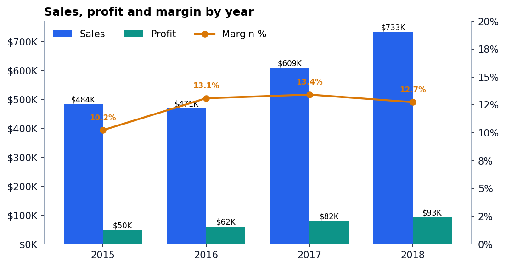
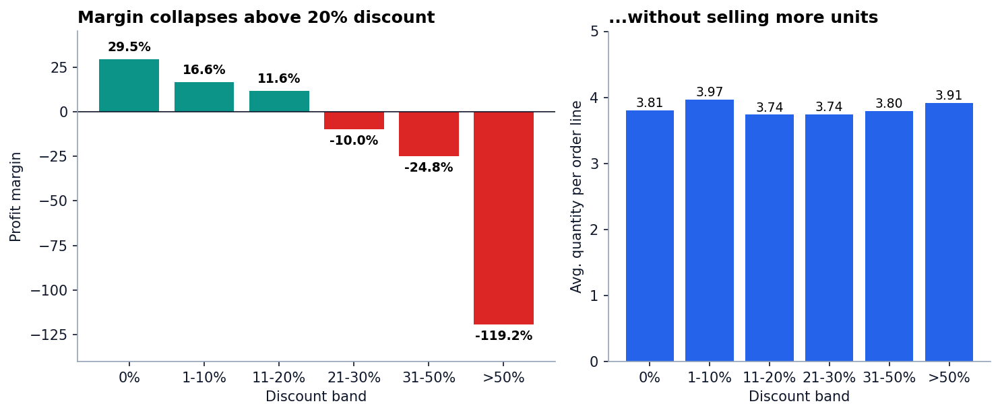
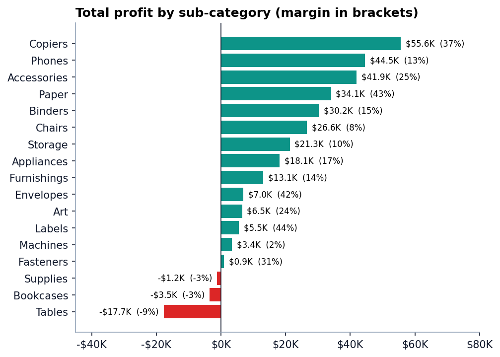
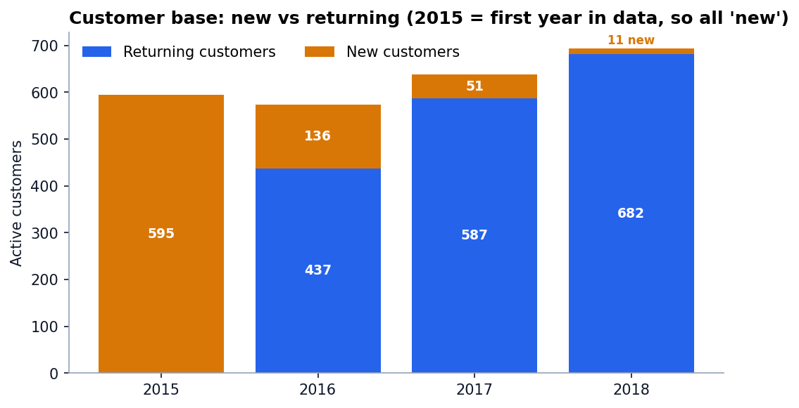

# Sales Performance Analysis: Superstore 2015-2018

End-to-end data analyst project: cleaning, SQL, Python analysis, RFM segmentation, an HTML dashboard and an executive slide deck, built to answer one question for management:

> **Where is the business growing, are promotions paying off, and how healthy is the customer base?**

| | |
|---|---|
| **Data** | Superstore sample dataset: 9,994 order lines, 5,009 orders, 793 customers, 1,862 products, Jan 2015 - Dec 2018 |
| **Tools** | Python (pandas, matplotlib, seaborn), SQL (SQLite, window functions), Jupyter, PowerPoint, static HTML |
| **Deliverables** | [Dashboard](dashboard/index.html) · [Notebook](notebooks/sales_performance_analysis.ipynb) · [SQL queries](sql/) · [Slide deck](slides/Sales_Performance_Report.pptx) · [Data quality log](reports/data_quality.md) |

## Headline findings

| # | Finding | Evidence |
|---|---|---|
| 1 | **Sales grew 51% (2015 to 2018), but margin peaked in 2017.** | Sales $484K to $733K; margin 10.2%, 13.1%, 13.4%, 12.7%. Profit grew +14% in 2018 vs sales +20%. |
| 2 | **Growth comes from more, smaller orders.** | Orders +74% while average order value fell from $500 to $435. |
| 3 | **Discounts above 20% destroy profit without lifting volume.** | Margin is 29.5% at 0% discount, 11.6% at 11-20%, then -10%, -25% and -119%. Average quantity per line is 3.7-3.9 in every band. Lines above 20% discount are 14% of volume but lose **$135K, equal to 32% of the profit earned at 20% or less**. |
| 4 | **Tables, Bookcases and Supplies lose money; Copiers is the star.** | Tables: $207K sales, -$17.7K profit (-8.6%), 55% of lines discounted over 20%. Copiers: +80% sales CAGR, 37% margin. Machines: shrinking (-11% CAGR), loss-making in 2018. |
| 5 | **Central's low margin is a discount problem, not a demand problem.** | Central margin 7.9% with 24% average discount; excluding lines above 20%, its margin is 24.8% vs East 25.1%. |
| 6 | **Customer acquisition has almost stopped.** | New customers: 136 (2016), 51 (2017), 11 (2018). Retention rose 73% to 79% to 87%. |
| 7 | **Revenue is concentrated.** | Top 20% of customers = 48% of sales. RFM Champions: 24% of customers, 40% of sales; At Risk + Lost: 25% of customers, 8% of sales. |






## Recommendations

1. **Cap discounts at 20%**, with manager approval above that. Deep discounts show no volume benefit.
2. **Re-price or restructure Tables, Bookcases and Supplies.**
3. **Review Central region discount policy**: the margin gap versus East and West is a pricing-discipline issue.
4. **Invest in Copiers, Accessories and Appliances**; bundle high-margin Paper, Labels and Envelopes into orders.
5. **Restart customer acquisition**: run win-back for *At Risk* customers and a loyalty tier for *Champions*.

## Business questions and where they are answered

| Question | SQL | Python |
|---|---|---|
| Overall performance by year and sub-category | `01_yearly_performance`, `02_subcategory_yearly`, `03_subcategory_ranking` | `03_analysis.py`, notebook sections 2-3 |
| Promotion effectiveness and efficiency | `04_discount_band`, `05_discount_leakage` | `03_analysis.py`, notebook section 4 |
| Customer behaviour and growth | `06_customer_new_vs_returning`, `07_customer_retention`, `08_customer_pareto` | `03_analysis.py`, `04_rfm.py`, notebook section 5 |
| Region and segment view | `09_region_segment` | `03_analysis.py` |

Example (SQL window functions): year-over-year growth.

```sql
WITH yearly AS (
    SELECT order_year AS yr, SUM(sales) AS sales, SUM(profit) AS profit
    FROM orders GROUP BY order_year
)
SELECT yr, ROUND(sales, 2) AS sales, ROUND(100.0 * profit / sales, 2) AS margin_pct,
       ROUND(100.0 * (sales - LAG(sales) OVER (ORDER BY yr)) / LAG(sales) OVER (ORDER BY yr), 2) AS sales_yoy_pct
FROM yearly ORDER BY yr;
```

## Repository structure

```
sales-performance-analysis/
├── data/
│   ├── raw/superstore.csv          # original export (includes stray People/Returns rows)
│   └── processed/orders_clean.csv  # cleaned, feature-engineered table
├── sql/                            # 9 analysis queries (SQLite dialect)
├── src/
│   ├── 01_clean.py                 # cleaning + validation checks
│   ├── 02_run_sql.py               # load SQLite, run /sql, export to reports/tables
│   ├── 03_analysis.py              # figures + key_findings.json
│   ├── 04_rfm.py                   # RFM segmentation
│   └── 05_build_dashboard.py       # static HTML dashboard
├── notebooks/sales_performance_analysis.ipynb   # narrated analysis with outputs
├── dashboard/index.html            # self-contained dashboard (GitHub Pages ready)
├── slides/                         # PowerPoint deck + generator
├── reports/                        # figures, tables, data quality log, key findings
└── run_all.sh
```

## How to run

```bash
git clone <your-repo-url> && cd sales-performance-analysis
python -m venv .venv && source .venv/bin/activate    # Windows: .venv\Scripts\activate
pip install -r requirements.txt
./run_all.sh                                          # or run the scripts in src/ in order
jupyter notebook notebooks/sales_performance_analysis.ipynb
```

To publish the dashboard: enable **GitHub Pages** (Settings, Pages, deploy from branch `main`, folder `/dashboard` or root) and open `.../dashboard/`.

## Method notes

- **Cleaning:** the raw export contains 806 extra rows from appended *People* and *Returns* worksheets (dropped) and 11 rows with a missing ZIP code (Burlington, VT, filled with 05401). Validation asserts unique `row_id`, positive sales, discount in [0, 1], ship date on or after order date and no missing values.
- **Discount bands:** 0%, 1-10%, 11-20%, 21-30%, 31-50%, >50% (upper bound inclusive), identical in SQL and pandas.
- **New vs returning:** a customer is *new* in the year of their first order. Retention is the share of customers active in year Y who order again in Y+1.
- **RFM:** recency, frequency and monetary value scored 1-4 by quartile rank; segments by total score (Champions 10-12, Loyal 8-9, Potential 6-7, At Risk 4-5, Lost 3).

## Limitations

- The dataset has **no promotion table**, so `discount` is a proxy for promotional intensity. Findings are associations, not causal effects: discounts may be targeted at already-weak products.
- 2015 is the first year in the data, so all 2015 customers count as "new"; 2018 retention cannot be measured.
- It is a sample dataset of a single (US) retailer; results illustrate the method rather than a real company.

## Data source

Superstore sample dataset (Tableau sample data), mirrored in the public GitHub repository `leonism/sample-superstore`. Used here for educational and portfolio purposes.

## Author

**Atallah** · Mathematics graduate (Universitas Pendidikan Indonesia) · aspiring Data Analyst
[LinkedIn](https://www.linkedin.com/in/your-profile) · [GitHub](https://github.com/your-username) · your-email@example.com

Licensed under the [MIT License](LICENSE).
